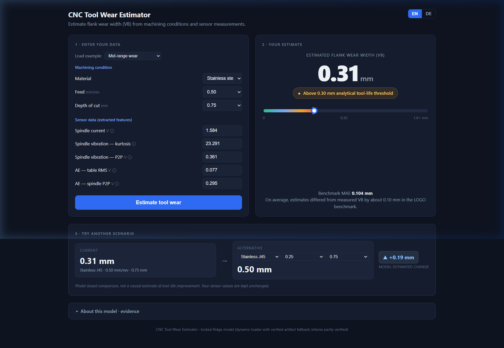
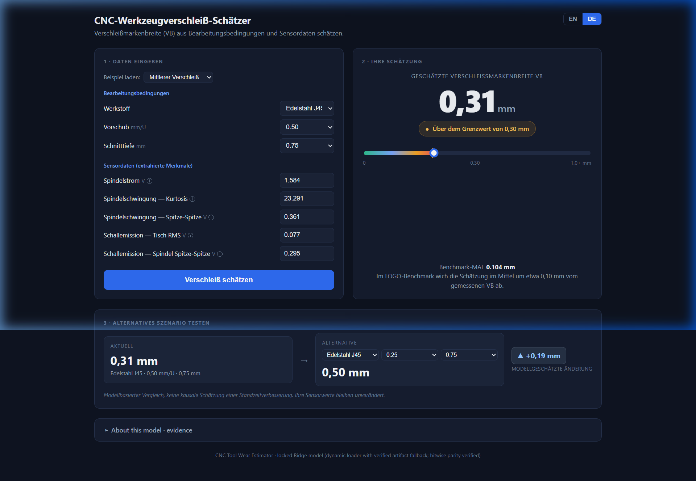
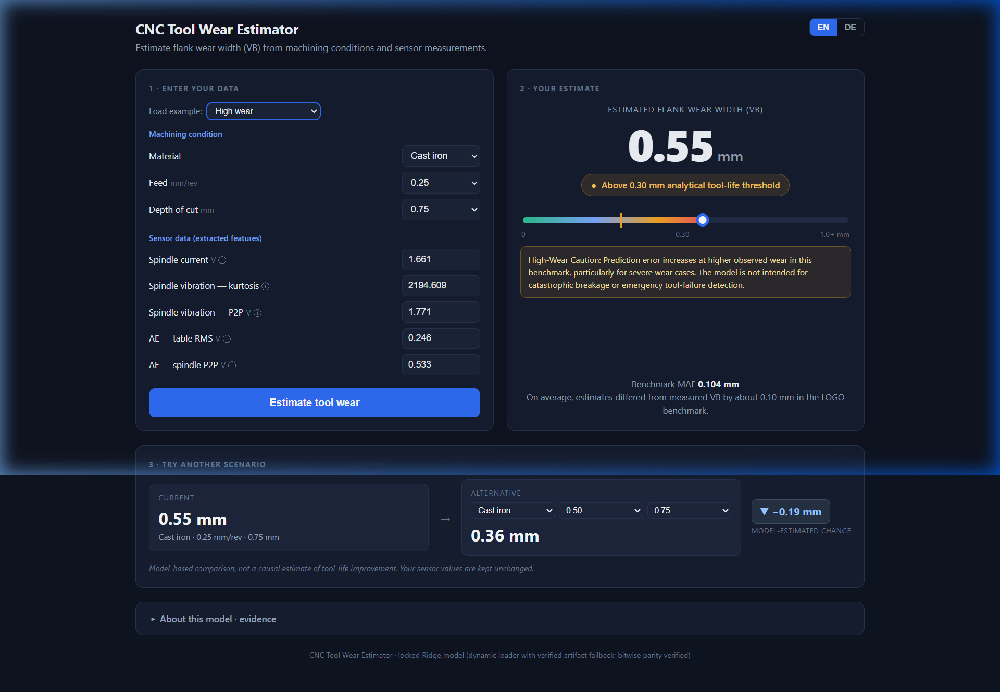

# CNC Tool Wear Intelligence

[](https://www.python.org/)
[](https://scikit-learn.org/)
[-green.svg)](https://www.nasa.gov/)
[](https://bright579523.github.io/CNC-Tool-Wear-Intelligence/)

A data science project for estimating flank wear in CNC milling using machining conditions and sensor measurements.

The project uses the NASA Milling Dataset to study how cutting conditions and sensor signals relate to tool wear, then builds a regression model to estimate flank wear width $VB$.

A browser dashboard is included to make the model easier to understand and use.

---

## What this project does

The analysis follows the workflow of a real manufacturing data problem:
1. Inspect the experimental data and tool wear progression
2. Compare wear across machining conditions
3. Analyse sensor signals and extract useful features
4. Compare regression models
5. Test generalisation to unseen tool cases and machining conditions
6. Analyse model behaviour and prediction errors
7. Build a simple interface for wear estimation

---

## Dataset

* **Dataset:** NASA Milling Dataset (UC Berkeley BEST Lab / NASA Ames PCoE)
* **Machine:** Matsuura MC-510V milling machine
* **Tooling:** KC710 coated carbide inserts
* **Workpiece materials:** Cast Iron and Stainless Steel J45
* **Cutting speed:** 200 m/min
* **Feed rates:** 0.25 and 0.50 mm/rev
* **Depth of cut:** 0.75 and 1.50 mm
* **Sensor channels:** Six sensory channels
* **Scope:** 16 tool cases, 145 valid labelled observations

The target variable is flank wear width:
* `VB_mm`

The analysis uses $VB = 0.30\text{ mm}$ as an analytical tool life threshold motivated by the uniform flank wear criterion described in ISO 8688-2 for milling.

---

## Sensor features

Five sensor features were selected for the final model:
* `smcAC_rms`
* `vib_spindle_kurtosis`
* `vib_spindle_p2p`
* `AE_table_rms`
* `AE_spindle_p2p`

These are combined with three machining context variables:
* `material_code`
* `DOC_mm`
* `feed_mm_rev`

---

## Model and validation

* **Primary model:** Ridge Regression with context fusion.
* **Formulation:** Standardised inputs, fitted with $\alpha = 1.0$.
* **Data splitting:** Random train-test splitting was avoided because multiple observations come from the same physical tools.

Two validation strategies were used:
* **Leave-One-Case-Out (LOGO):** Tests performance on an unseen tool case.
* **Leave-One-Condition-Out (LOCO):** Tests performance on an unseen combination of the tested machining factors.

---

## Results

| Model Setup | Validation Strategy | MAE |
| :--- | :--- | :---: |
| Sensor-only Ridge | LOGO | 0.1361 mm |
| **Ridge with machining context** | **LOGO** | **0.1044 mm** |
| **Ridge with machining context** | **LOCO** | **0.1221 mm** |

* The context-based model reduced LOGO MAE by about **47.7%** compared with the mean baseline (and by **23.3%** compared with sensor-only Ridge).
* SVR achieved the lowest average LOCO MAE at 0.1149 mm, but **Ridge was selected as the primary model** because it provides a simpler and more directly interpretable formulation while maintaining strong performance.
* **GBDT** is included as a supporting nonlinear model.

---

## Dashboard

* **Live Demo:** [Open Interactive Dashboard on GitHub Pages](https://bright579523.github.io/CNC-Tool-Wear-Intelligence/)
* **Local file:** [`index.html`](index.html)

The dashboard allows domain engineers and evaluators to:
* Input machining parameters and extracted sensory features
* Obtain an immediate flank wear ($VB$) estimate powered by the locked Ridge model
* Contextualise the prediction against the ISO 8688-2 analytical threshold ($0.30\text{ mm}$)
* Evaluate what-if machining scenarios ($\Delta VB$) holding current sensor measurements constant
* Toggle between English and German engineering terminology

### 1. Baseline Wear Estimation & Scenario Comparison (English)



* **Operating Inputs:**
  * Material: **Stainless steel J45**
  * Feed: **$0.50\text{ mm/rev}$**
  * Depth of cut: **$0.75\text{ mm}$**
  * Sensor features: Spindle current $= 1.584\text{ V}$, Spindle vibration kurtosis $= 23.291$, Spindle vibration P2P $= 0.361\text{ V}$, AE table RMS $= 0.077\text{ V}$, AE spindle P2P $= 0.295\text{ V}$
* **Estimation Result:**
  * Flank Wear Width ($VB$): **$0.31\text{ mm}$**
  * Tool-Life Indicator: **Above 0.30 mm analytical tool-life threshold** (Amber status)
  * Visual Scale: Progress marker aligned at $0.31\text{ mm}$ on the calibrated scale
* **What-If Scenario Comparison:**
  * Evaluated alternative: Same sensor signals, but switching feed rate to **$0.25\text{ mm/rev}$**
  * Alternative estimate: **$0.50\text{ mm}$** ($\Delta = \mathbf{+0.19\text{ mm}}$)

---

### 2. Localised Engineering Interface (German / Deutsch)

The entire interface supports German manufacturing and mechanical engineering conventions (DIN/ISO terminology, localized decimal comma formatting, and German glossaries).



* **Fachterminologie & Lokalisierung:**
  * Kopfzeile: *CNC-Werkzeugverschleiß-Schätzer*
  * Schnittparameter: *Werkstoff: Edelstahl J45*, *Vorschub: 0,50 mm/U* (Umdrehungsvorschub $f_{rev}$), *Schnitttiefe: 0,75 mm*
  * Sensorsignale: *Spindelstrom (1,584 V)*, *Spindelschwingung (Kurtosis 23,291; Spitze-Spitze 0,361 V)*, *Schallemission (Tisch RMS 0,077 V; Spindel Spitze-Spitze 0,295 V)*
* **Ergebnis & Status:**
  * Geschätzte Verschleißmarkenbreite ($VB$): **$0,31\text{ mm}$**
  * Status-Pille: **Über dem Grenzwert von 0,30 mm**
  * Szenario-Vergleich: *Aktuell 0,31 mm* $\rightarrow$ *Alternative 0,50 mm* (*Modellgeschätzte Änderung +0,19 mm*)
  * Genauigkeitsangabe: *Benchmark-MAE 0,104 mm*

---

### 3. Severe Wear Regime & Model Uncertainty Advisory



* **Operating Inputs (Severe Tool Condition):**
  * Material: **Cast iron**
  * Feed: **$0.25\text{ mm/rev}$**
  * Depth of cut: **$0.75\text{ mm}$**
  * Sensor features: Spindle current $= 1.661\text{ V}$, Spindle vibration kurtosis $= 2194.609$, Spindle vibration P2P $= 1.771\text{ V}$, AE table RMS $= 0.246\text{ V}$, AE spindle P2P $= 0.533\text{ V}$
* **Estimation Result & Safety Transparency:**
  * Flank Wear Width ($VB$): **$0.55\text{ mm}$**
  * Status: **Above 0.30 mm analytical tool-life threshold**
  * **High-Wear Caution Banner:** Transparently warns that prediction variance and residual error increase significantly at advanced wear stages, reminding the user that the linear model is not designed for catastrophic tool breakage detection.
  * Alternative Scenario: Increasing feed rate to $0.50\text{ mm/rev}$ yields an alternative estimate of **$0.36\text{ mm}$** ($\Delta = \mathbf{-0.19\text{ mm}}$).

---

### Model Parity & Verification

* The dashboard loads the Ridge model artifact directly from [`data/ridge_model.json`](data/ridge_model.json).
* End-to-end mathematical parity between scikit-learn in Python and the browser client is verified in [`scripts/verify_dashboard_parity.py`](scripts/verify_dashboard_parity.py) ($\le 2.22 \times 10^{-16}\text{ mm}$ machine precision difference).

---

## Key findings

* Machining context improves wear estimation compared with using sensor features alone.
* `smcAC_rms` receives the largest linear weight in the final Ridge model.
* Prediction error becomes larger at higher observed wear.
* The highest wear observation is difficult for both models to estimate accurately.
* Model performance should be interpreted within the range and conditions represented in this dataset.

---

## Limitations

* This is a **portfolio study based on a small experimental dataset**.
* The model is **not intended to be used as a production tool replacement system, an emergency failure detector, or a universal tool life model**.
* The results are limited to the experimental conditions represented in the NASA dataset.

---

## Reproduce

1. Install the pinned dependencies:
```bash
pip install -r requirements.txt
```

2. Verify model and dashboard parity:
```bash
python scripts/verify_dashboard_parity.py
```

3. Then open `index.html` in a modern browser.

---

## Project status

The analysis, model selection, validation, dashboard design, and reproducibility checks are complete.
